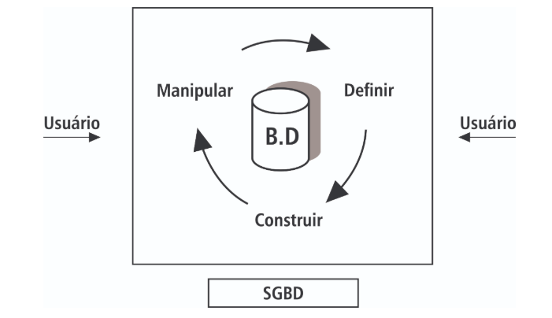

* Um Banco de Dados é uma coleção logicamente coerente de dados com um determinado significado inerente. Isto significa que um conjunto aleatório de dados não pode ser considerada um Banco de Dados;
* Um Banco de Dados é projetado, construído e composto por um conjunto de dados para um propósito específico (como no nosso exemplo acima para armazenar um conjunto de informações de alunos). Existe um grupo de usuários ou algumas aplicações pré-concebidas onde estes dados serão utilizados;
* Um Banco de Dados representa aspectos de uma parte restrita do mundo real, denominado de minimundo. Alterações que ocorra no minimundo são refletidas em todo o Banco de Dados.
* Um banco de dados computadorizado é mantido por um grupo de aplicativos chamado de Sistema de Gerenciamento de Bancos de Dados (SGBD), que é uma coleção de programas que permite ao usuário definir, construir e manipular um Banco de Dados para as mais diversas aplicações. O objetivo principal de um sistema de banco de dados é possibilitar um ambiente que seja adequado e eficiente para uso na recuperação e armazenamento de informações.

Descrição da imagem abaixo.

Figura 1 - Sistema Gerenciador de Banco de Dados (SGBD)

Banco de Dados e seu software são juntos denominados de Sistema de Bancos de Dados (SBD).

Imagine um armário de aço, com várias gavetas, em cada gaveta contém alguma informação (como a ficha do aluno) que estão agrupadas de acordo com seu tipo. O armário no caso é forma de gerenciamento dos dados ali contidos, lá podemos: inserir, excluir, selecionar ou alterar algum documento que ali contenha. Neste primeiro momento podemos pensar que um banco de dados computacional consiste em “levar” os dados deste armário de aço para o computador, porém seguiremos algumas regras para que o armazenamento seja mais eficiente.