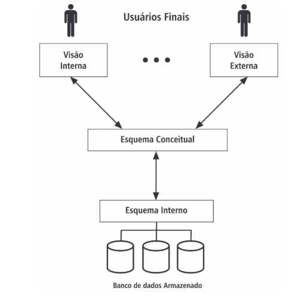

# Níveis de Abstração

A arquitetura ANSI/SPARC prevê múltiplas visões de dados, um esquema conceitual (lógico) e um esquema interno (físico). Um Sistema de Banco de Dados (SBD) se divide em geral em três níveis:

### Nível Externo

O nível externo possui as diversas descrições do banco de dados de acordo com os grupos de usuários. Cada usuário ou grupo de usuários pode ter uma visão personalizada dos dados, que inclui apenas as informações relevantes para suas necessidades específicas. Este nível é responsável por garantir que os usuários possam interagir com o banco de dados de maneira intuitiva e segura, sem precisar conhecer os detalhes internos.

### Nível Conceitual

O nível conceitual descreve a estrutura de todo o banco de dados para uma determinada comunidade de usuários, ocultando detalhes sobre a organização física dos dados. Ele apresenta a descrição lógica dos dados e das ligações existentes entre eles. Este nível é crucial para garantir a integridade e a consistência dos dados, pois define as regras e restrições que governam o banco de dados.

### Nível Interno

O nível interno descreve a estrutura de armazenamento físico dos dados do banco de dados. Ele inclui detalhes sobre os caminhos de acesso aos dados internamente, como índices, estruturas de armazenamento e métodos de acesso. Este nível é responsável por otimizar o desempenho do banco de dados, garantindo que as operações de leitura e escrita sejam realizadas de maneira eficiente.

*Figura 1 - Níveis de Abstração*

### Resumo dos Níveis de Abstração

- **Nível Externo**: O que o usuário pensa, quer e deseja visualizar.
- **Nível Conceitual**: Como o projetista irá implementar o banco de dados.
- **Nível Interno**: Como os dados serão armazenados e acessados fisicamente.

### Importância dos Níveis de Abstração

Os três níveis de abstração apresentam apenas descrições dos dados. Como cada nível apresenta descrições diferentes para os mesmos dados, torna-se necessário converter uma representação em outra, ou seja, definir mapeamentos de dados entre os níveis. Esses mapeamentos garantem que as alterações em um nível não afetem os outros níveis, proporcionando flexibilidade e independência de dados.

---

Este material foi baseado em:
FRANCO, Matheus. Sistemas de Gerenciamento de Banco de Dados. São João da Boa Vista: Instituto Federal de Educação, Ciência e Tecnologia de São Paulo/Rede e-Tec, 2013.