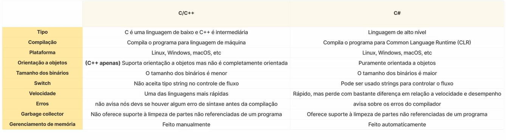

# C#?

C# (pronunciado "C-Sharp") é uma linguagem de programação moderna, orientada a objetos e fortemente tipada, desenvolvida pela Microsoft. Ela foi criada em 2000 por Anders Hejlsberg como parte da plataforma .NET e tem sido amplamente utilizada para o desenvolvimento de aplicações desktop, web, móveis e jogos.

## Características do C#

C# possui várias características que o tornam uma linguagem poderosa e versátil:

- **Orientação a Objetos**: suporta conceitos como herança, polimorfismo e encapsulamento.
- **Tipagem Forte**: todas as variáveis devem ser declaradas com um tipo específico.
- **Gerenciamento Automático de Memória**: conta com Garbage Collector para evitar vazamentos de memória.
- **Multiplataforma**: pode ser executado em Windows, Linux e macOS via .NET Core.
- **Segurança**: possui recursos internos que evitam erros comuns, como acesso indevido à memória.
- **Multithreading**: suporte nativo para execução concorrente de processos.
- **Compatibilidade com .NET**: permite integração com bibliotecas e frameworks do ecossistema .NET.

## Estrutura Básica de um Programa em C#

Todo programa em C# precisa ter pelo menos uma classe com um método `Main`, que é o ponto de entrada da aplicação.

```csharp
using System; // Importação de namespace

class Program
{
    static void Main()
    {
        Console.WriteLine("Olá, Mundo!");
    }
}
```

### Explicação:
- `using System;` → Importa a biblioteca `System`, que contém funcionalidades essenciais.
- `class Program` → Define uma classe chamada `Program`.
- `static void Main()` → Método principal que será executado ao iniciar o programa.
- `Console.WriteLine("Olá, Mundo!");` → Exibe uma mensagem no console.

## Aplicações do C#

C# é uma linguagem versátil e pode ser usada em diversos tipos de desenvolvimento:

- **Aplicações Desktop**: Com Windows Forms e WPF.
- **Desenvolvimento Web**: Usando ASP.NET para criar APIs e sites dinâmicos.
- **Jogos**: Principal linguagem usada na Unity Engine.
- **Aplicações Mobile**: Com Xamarin para Android e iOS.
- **Cloud e Microservices**: Utilizando .NET Core para desenvolvimento distribuído.
- **Machine Learning**: Suporte via ML.NET.

## Benefícios do C#

✔ Sintaxe limpa e organizada
✔ Suporte da Microsoft e grande comunidade
✔ Integração nativa com .NET e Azure
✔ Segurança e robustez
✔ Suporte para programação assíncrona

## Conclusão

C# é uma linguagem poderosa, moderna e amplamente utilizada no desenvolvimento de software. Com seu suporte a diversas plataformas e sua integração com o ecossistema .NET, ela se tornou uma das linguagens mais populares entre desenvolvedores. Se você busca uma linguagem eficiente e versátil, C# é uma excelente escolha!


## Diferenças entre C, C++ e C-Sharp

Embora os nomes sejam semelhantes, as três linguagens são completamente diferentes em termos de sintaxe e dificuldade de aprendizado. C é uma linguagem de baixo nível, com paradigma procedural, enquanto C++ é uma linguagem intermediária, com suporte para programação orientada a objetos. Já C# é uma linguagem de alto nível, puramente orientada a objetos. C e C++ são amplamente utilizados em sistemas embarcados e desenvolvimento de drivers, enquanto C# é usado para desenvolvimento de aplicativos, sites e até mesmo jogos.




## O que é um Namespace?

Um **namespace** em C# é um agrupamento lógico de tipos, como **classes**, **interfaces**, **structs**, **enums** e **delegates**. Ele serve para organizar o código e evitar conflitos de nomes entre diferentes partes de um programa.

Os namespaces permitem que você organize melhor seus arquivos e evite colisões quando há classes com o mesmo nome em diferentes bibliotecas.

## Estrutura de um Namespace

Um namespace é definido com a palavra-chave `namespace`, seguida pelo nome do namespace. Dentro dele, podemos definir classes, structs e outros tipos.

### Exemplo básico:

```csharp
namespace MeuProjeto
{
    class MinhaClasse
    {
        public void MeuMetodo()
        {
            Console.WriteLine("Olá, Namespace!");
        }
    }
}
```

Aqui, **`MeuProjeto`** é o namespace que contém a classe **`MinhaClasse`**. Dessa forma, evitamos conflitos com outras classes que possam ter o mesmo nome.


## Usando Namespaces no Código

Para usar uma classe que está em um namespace diferente, podemos:

1. **Utilizar o nome completo do namespace**
2. **Importar o namespace usando `using`**

### Exemplo 1: Sem `using`

```csharp
namespace MeuProjeto
{
    class MinhaClasse
    {
        public void MostrarMensagem()
        {
            Console.WriteLine("Mensagem do MeuProjeto");
        }
    }
}

class Program
{
    static void Main()
    {
        MeuProjeto.MinhaClasse obj = new MeuProjeto.MinhaClasse();
        obj.MostrarMensagem();
    }
}
```

Aqui, usamos o nome completo `MeuProjeto.MinhaClasse` para acessar a classe.

### Exemplo 2: Com `using`

```csharp
using MeuProjeto; // Importando o namespace

class Program
{
    static void Main()
    {
        MinhaClasse obj = new MinhaClasse();
        obj.MostrarMensagem();
    }
}
```

Usando `using`, podemos referenciar diretamente `MinhaClasse`, sem precisar escrever o namespace completo.

## Namespaces Aninhados

Também podemos ter namespaces dentro de namespaces para organizar melhor os códigos.

### Exemplo:

```csharp
namespace Empresa
{
    namespace RH
    {
        class Funcionario
        {
            public string Nome;
            public string Cargo;
        }
    }
}

class Program
{
    static void Main()
    {
        Empresa.RH.Funcionario func = new Empresa.RH.Funcionario();
        func.Nome = "Carlos";
        func.Cargo = "Desenvolvedor";
    }
}
```

Aqui, **RH** está dentro do namespace **Empresa**, criando uma estrutura hierárquica.

## Benefícios de Usar Namespaces

✔ Organização do código
✔ Evita conflitos de nome
✔ Facilita a reutilização e manutenção do código
✔ Melhora a legibilidade e modularidade do projeto

## Conclusão

Os **namespaces** são uma parte essencial da organização do código em C#. Eles ajudam a evitar conflitos de nomes e tornam o código mais estruturado. Compreender como utilizá-los corretamente é fundamental para o desenvolvimento de aplicações bem organizadas.

## O que são Classes em C#?
Uma classe é como um molde que usamos para criar objetos e utilizá-los. Por exemplo, podemos ter uma classe para definir um usuário da plataforma, com propriedades como nome, e-mail e data de nascimento. Além das características, uma classe também pode definir comportamentos, que são funções que determinam o que acontece quando realizamos ações. No C#, podemos criar uma classe utilizando a palavra-chave class seguida pelo nome da classe. Podemos também criar classes adicionais dentro do mesmo projeto.

Portanto uma **classe** em C# é um modelo para criar objetos. Ela define atributos (variáveis) e métodos (funções) que os objetos dessa classe terão.

### Estrutura de uma Classe

```csharp
class Pessoa
{
    // Atributos (ou campos)
    public string Nome;
    public int Idade;
    
    // Método (ou comportamento)
    public void Apresentar()
    {
        Console.WriteLine($"Olá, meu nome é {Nome} e tenho {Idade} anos.");
    }
}
```

Essa classe **Pessoa** tem dois atributos (`Nome` e `Idade`) e um método (`Apresentar`).

# Modificadores de Acesso em C#

Em **C#**, os **modificadores de acesso** são palavras-chave que determinam a visibilidade e o nível de acesso a membros de uma classe, como **propriedades**, **métodos**, **campos** e **eventos**. Eles controlam de onde um membro pode ser acessado dentro de seu código.

## O que são Classes em C#?

Uma **classe** em C# é uma estrutura que define um tipo de dado customizado. Ela pode conter:

- **Campos** (variáveis)
- **Propriedades**
- **Métodos**
- **Eventos**
- **Construtores**

Uma classe serve como **modelo** ou **molde** para criar objetos. Quando um objeto é criado a partir de uma classe, ele é conhecido como uma **instância** da classe.

Exemplo de uma classe simples:

```csharp
public class Carro
{
    public string Modelo { get; set; }
    private int velocidadeMaxima;

    public Carro(string modelo, int velocidadeMaxima)
    {
        Modelo = modelo;
        this.velocidadeMaxima = velocidadeMaxima;
    }

    public void Acelerar()
    {
        Console.WriteLine("Acelerando o carro...");
    }

    private void AjustarVelocidadeMaxima(int novaVelocidade)
    {
        velocidadeMaxima = novaVelocidade;
    }
}
```

# Membros de uma Classe

- **Campos**: Variáveis internas de uma classe, usadas para armazenar dados.
- **Propriedades**: Métodos especiais usados para acessar ou modificar os valores dos campos de uma classe. Elas atuam como uma combinação entre um campo e um método.
- **Métodos**: Funções que realizam ações ou operações. São usados para definir o comportamento de uma classe.
- **Construtores**: Métodos especiais usados para inicializar objetos de uma classe. O construtor é chamado quando um novo objeto é criado.

---

# Modificadores de Acesso em C#

Existem cinco principais modificadores de acesso em C#:

### 1. `public`
- **Definição**: Membros públicos podem ser acessados de qualquer lugar, seja de dentro ou fora da classe ou do assembly.
- **Uso**: Quando você deseja que um membro ou classe seja acessível em qualquer parte do seu código.

#### Exemplo:

```csharp
public class Carro
{
    public string Modelo { get; set; }  // Pode ser acessado de qualquer lugar
}
```

### 2. `private`
- **Definição**: Membros privados só podem ser acessados dentro da própria **classe** ou **struct** onde foram definidos.
- **Uso**: Usado para garantir que a lógica interna de uma classe não seja acessada ou modificada diretamente.

#### Exemplo:

```csharp
public class Carro
{
    private int velocidadeMaxima;  // Só pode ser acessado dentro da classe Carro

    public Carro(int velocidadeMaxima)
    {
        this.velocidadeMaxima = velocidadeMaxima;
    }
}
```
### 3. `protected`
- **Definição**: Membros protegidos podem ser acessados pela própria **classe** e por qualquer **classe derivada** (subclasse).
- **Uso**: Usado quando se deseja que membros sejam acessíveis por subclasses, mas não por código fora da hierarquia de classes.

#### Exemplo:

```csharp
public class Carro
{
    protected int velocidadeMaxima;

    public Carro(int velocidadeMaxima)
    {
        this.velocidadeMaxima = velocidadeMaxima;
    }
}

public class CarroEsportivo : Carro
{
    public CarroEsportivo(int velocidadeMaxima) : base(velocidadeMaxima)
    {
        // Acessa o campo protegido da classe base
        Console.WriteLine(velocidadeMaxima);
    }
}
```

### 4. `internal`
- **Definição**: Membros internos são acessíveis apenas dentro do mesmo **assembly** (projeto).
- **Uso**: Usado quando você quer limitar o acesso a membros dentro de um único assembly, mas não se importa com a visibilidade em todas as classes dentro do projeto.

#### Exemplo:

```csharp
public class Carro
{
    internal string Modelo { get; set; }  // Só pode ser acessado dentro do mesmo assembly
}
```

### 5. `protected internal`
- **Definição**: Membros protegidos internos podem ser acessados dentro do mesmo **assembly** ou em **classes derivadas** (subclasses), tanto no mesmo assembly quanto em outros assemblies.
- **Uso**: Quando você quer que membros sejam acessíveis em subclasses ou no mesmo assembly.

#### Exemplo:

```csharp
public class Carro
{
    protected internal int velocidadeMaxima;
}
```

### 6. `private protected`
- **Definição**: Membros privados protegidos podem ser acessados somente dentro da própria **classe** ou em **subclasses**, mas somente dentro do mesmo **assembly**.
- **Uso**: Combinado entre privado e protegido, limitando o acesso a classes dentro do mesmo assembly e em subclasses.

#### Exemplo:

```csharp
public class Carro
{
    private protected int velocidadeMaxima;
}
```

### Resumo

- **public**: Acessível em qualquer lugar.
- **private**: Acessível apenas dentro da classe.
- **protected**: Acessível dentro da classe e em classes derivadas.
- **internal**: Acessível dentro do mesmo assembly.
- **protected internal**: Acessível no mesmo assembly e em classes derivadas.
- **private protected**: Acessível dentro da classe e em classes derivadas, mas no mesmo assembly.

Esses modificadores de acesso ajudam a controlar a visibilidade dos membros da classe, garantindo **encapsulamento** e mantendo a integridade da lógica interna de suas classes.

# Tipos numéricos

Existem dois grupos principais: os inteiros e os de ponto flutuante. Os inteiros são números sem casas decimais, como 0, 1, 2, etc. Já os de ponto flutuante são números com casas decimais, como 1.5, 1.7, 3.14, etc. No Visual Studio, podemos declarar variáveis numéricas utilizando os tipos int e long para inteiros, e double, float e decimal para ponto flutuante. Cada tipo tem um intervalo e precisão diferentes. É importante lembrar que ao atribuir valores literais, é necessário indicar o tipo correto, como colocar F para float e M para decimal. Além disso, podemos utilizar o underline para facilitar a leitura de números grandes.